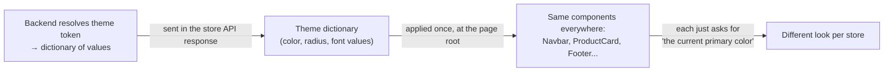
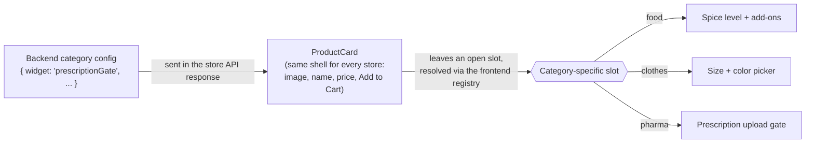
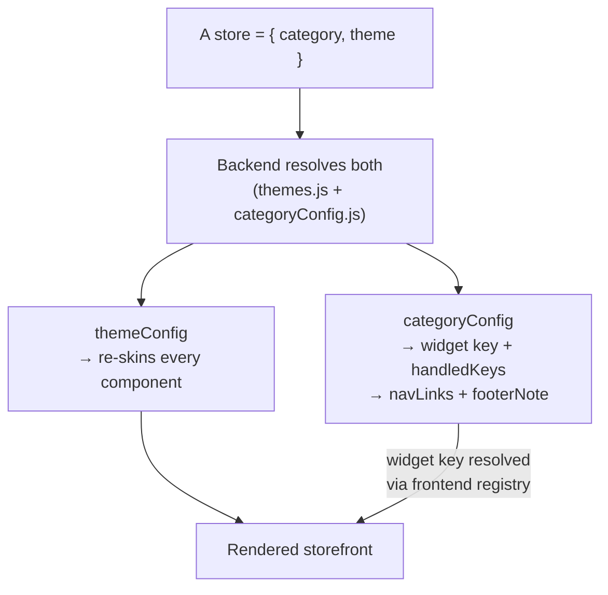

# Frontend Architecture: One Set of Components, Many Storefronts

Happilee runs 9 different-looking, different-feeling stores — 3 categories
(`food`, `clothes`, `pharma`) × 3 visual themes — from a single React
component tree. There is no per-store code, and no store-specific
components. Every store renders the *same* `Navbar`, the *same*
`ProductCard`, the *same* `Footer`. What changes is not the components —
it's two things fed *into* them: a **look** and a **shape**.

This document explains that idea conceptually: how one component can wear
different skins, and how one component can show different sub-parts,
without ever forking into "the food version" and "the clothes version."

## The two things that vary, and the one thing that doesn't

Think of every store as answering two unrelated questions:

- **"What does it look like?"** — its color palette, corner roundness,
  typography. This is the **theme**.
- **"What is it selling, and what does the buying flow need to ask?"** — a
  restaurant needs a spice-level picker, a clothing store needs a size
  picker, a pharmacy needs a prescription check. This is the **category**.

These two questions are answered completely independently of each other,
which is why a "warm, cozy" theme and a "bold, dark" theme can each be
applied to a food store *or* a clothes store *or* a pharmacy without any
extra work. Neither axis knows the other exists.

What stays fixed underneath both is the component itself — its structure,
its behavior, its markup. A `ProductCard` is always a `ProductCard`. It
never gets rewritten per store; it gets *dressed* differently and *filled
in* differently.

## Axis 1 — Same component, different look (theming)

Every component in this app is written without any hardcoded colors, corner
radii, or fonts. Instead of a button saying "make me orange with rounded
corners," it says "make me *whatever this store's primary color and card
radius are." That level of indirection is the entire trick: components
describe roles ("primary action color," "card corner radius," "heading
font"), and a theme is just a dictionary that fills those roles in with
actual values.

When a store page loads, the app fetches that store from the backend, which
resolves the theme token into its full dictionary of values and includes it
in the response. The frontend applies that dictionary once, at the very top
of the page. Every component underneath — buttons, cards, badges, the
navbar, the footer — automatically picks up those values, because they were
always asking for "the current primary color," never "orange." Swap the
dictionary, and the entire page re-skins itself, top to bottom, without a
single component being touched or even being aware that a swap happened.

This is why a "Warm" theme (terracotta, cream background, serif headings,
soft rounded cards) and a "Bold" theme (hot pink on near-black, sharp
corners, heavy sans-serif) can sit side by side, applied to any category,
with the components themselves never knowing which one is active. Adding a
fourth theme later is purely an act of writing a new dictionary of values on
the backend — no frontend component changes, because no component was ever
written *for* a specific theme in the first place, and the frontend never
kept its own copy of the theme table to update.

## Axis 2 — Same component, different sub-parts (categories)

Styling is only half the story — a pharmacy and a t-shirt shop don't just
need to *look* different, they need to *behave* differently. A shirt needs a
size picker. A curry needs a spice-level picker. A prescription medicine
needs to block checkout until a prescription is uploaded. These aren't
skin-deep differences — they're genuinely different pieces of interactive
UI that don't apply to the other categories at all.

Rather than teaching the product card about every category ("if this is
food, show spice options; if this is clothes, show sizes..."), the product
card stays completely generic and simply leaves a **slot** open near the
bottom — a spot where "whatever this category's special widget is" gets
plugged in. The backend's category config is what decides *which* widget a
category needs — it comes back on the store response as a widget key (e.g.
`"prescriptionGate"`), alongside the nav links and footer copy for that
category. Since an actual component can't travel over JSON, a small
frontend registry is the one remaining place that resolves that key to real
code. The product card asks the registry "what component does this key
map to?" and renders whatever comes back, without caring what it actually
is.

That's the whole mechanism: the shell (image, name, price, description,
add-to-cart button) is identical for every product in every store. The slot
inside it is filled differently depending on category — a spice-and-modifier
picker for food, a size-and-color picker for clothes, a prescription-upload
gate for pharma, or nothing at all if a category doesn't need one. The
widget in the slot can even control whether "Add to Cart" is allowed to be
pressed yet — which is how "you can't check out without a prescription"
gets enforced, entirely inside that one slot, without the cart or checkout
pages needing any pharma-specific logic.

The same generic-shell-plus-slot idea applies one level up, too: the navbar
and footer are single shared components, but the *links* in the navbar and
the *note* in the footer come straight from the same backend category
config — "Menu / Offers / Track Order" for food, "Collection / Size Guide /
Returns" for clothes — rather than being hardcoded into the component or
looked up from a table the frontend maintains itself.

## Putting both axes together

A store, then, is really just two independent choices layered onto one
fixed set of components: pick a theme (how it looks), pick a category
(which slot-fillers and which copy apply). Neither choice touches the
component tree itself — the components are the constant; the theme and the
category are inputs. Both choices are resolved on the **backend** — the
frontend receives the already-resolved dictionaries in the store API
response and just renders them; it doesn't hold a copy of either table.

This is why the matrix scales the way it does: adding a *tenth* store never
means writing a tenth version of anything. If it's a new combination of an
existing theme and category, it's zero new code — just a new entry saying
"this store uses this theme and this category." If it's a genuinely new
look, it's one new theme dictionary — added to the backend, no frontend
deploy required. If it's a genuinely new kind of product with a widget that
already exists, it's one new row in the backend's category config — again,
no frontend deploy. Only a genuinely new *kind* of widget (code that has
never existed before) requires touching the frontend: one new component,
plus one new line in the registry. The shared components — the part that's
actually the bulk of the UI — never grow, never fork, and never need to
know how many stores exist.

## Why this holds together

Two disciplines make this possible, and both are really the same idea
applied twice:

- Components never hardcode a value that could plausibly differ by
  store — not a color, not a corner radius, not a piece of nav-link text,
  not a category-specific widget. They ask for it instead.
- Nothing outside the theme system knows what a theme looks like, and
  nothing outside the category config knows what a category needs. Each
  axis is a self-contained answer to one question, resolved in a single,
  well-known place — the backend — never scattered across the codebase as
  conditionals.

Concretely: `backend/src/data/themes.js` and
`backend/src/data/categoryConfig.js` are that single well-known place. The
frontend's `verticals/registry.js` is the one necessary exception — a
component reference can't be serialized into an API response, so the
backend sends a widget *key* and the frontend registry is what turns that
key into the actual component. Everything else about "what varies per
store" is data the backend owns, not code the frontend maintains.

The result is a UI where "add a new look" and "add a new kind of store" are
both small, additive, one-place changes — never a rewrite, and never a
branch buried inside a shared component. And because that one place is now
the backend, most of those additive changes don't require a frontend
deploy at all.
